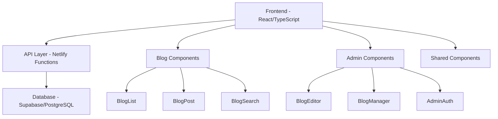

# Design Document

## Overview

The personal blog feature will be integrated into the existing React/TypeScript portfolio website as a dedicated section. The blog will support full CRUD operations for blog posts, with a clean separation between public-facing blog pages and admin management interfaces. The design leverages the existing component architecture, routing system, and styling approach while adding new database integration capabilities.

## Architecture

### High-Level Architecture



### Technology Stack Integration

- **Frontend**: React 18 + TypeScript + Vite (existing)
- **Styling**: TailwindCSS + Framer Motion (existing)
- **Routing**: React Router DOM (existing)
- **Database**: Supabase (PostgreSQL) - recommended for Netlify integration
- **API**: Netlify Functions (serverless)
- **Markdown**: react-markdown + remark/rehype plugins
- **Code Highlighting**: Prism.js or highlight.js
- **Rich Text Editor**: TinyMCE or Tiptap for admin interface

## Components and Interfaces

### Data Models

#### BlogPost Interface
```typescript
interface BlogPost {
  id: string;
  title: string;
  slug: string;
  content: string; // Markdown content
  excerpt: string;
  tags: string[];
  published: boolean;
  publishedAt: Date | null;
  createdAt: Date;
  updatedAt: Date;
  readingTime: number; // estimated minutes
}

interface BlogTag {
  id: string;
  name: string;
  slug: string;
  count: number;
}
```

### Component Architecture

#### Public Blog Components

**BlogSection Component** (replaces current Blog.tsx)
- Integrates into MainLayout as a new section
- Shows recent blog posts preview
- Links to full blog page

**BlogPage Component** (new route: /blog)
- Full blog listing with pagination
- Search and filter functionality
- Tag-based filtering

**BlogPostPage Component** (new route: /blog/:slug)
- Individual blog post display
- Markdown rendering with syntax highlighting
- Navigation to previous/next posts

**BlogSearch Component**
- Real-time search functionality
- Filter by tags
- Search results highlighting

#### Admin Components (Protected Routes)

**AdminLayout Component**
- Protected admin interface
- Simple authentication (password-based)
- Navigation for blog management

**BlogEditor Component**
- Rich text editor with markdown preview
- Tag management
- Draft/publish toggle
- Image upload support

**BlogManager Component**
- List all posts (published and drafts)
- Quick actions (edit, delete, publish/unpublish)
- Bulk operations

### API Endpoints (Netlify Functions)

```
GET    /api/blog/posts          - Get published posts (with pagination, search, tags)
GET    /api/blog/posts/:slug    - Get single post by slug
POST   /api/blog/posts          - Create new post (admin)
PUT    /api/blog/posts/:id      - Update post (admin)
DELETE /api/blog/posts/:id      - Delete post (admin)
GET    /api/blog/tags           - Get all tags with counts
POST   /api/blog/auth           - Admin authentication
```

### Routing Structure

```
/ (existing MainLayout with new blog section)
/blog (BlogPage - public blog listing)
/blog/:slug (BlogPostPage - individual post)
/admin (AdminLayout - protected)
/admin/blog (BlogManager - post management)
/admin/blog/new (BlogEditor - create post)
/admin/blog/edit/:id (BlogEditor - edit post)
```

## Data Models

### Database Schema (Supabase/PostgreSQL)

```sql
-- Blog posts table
CREATE TABLE blog_posts (
  id UUID PRIMARY KEY DEFAULT gen_random_uuid(),
  title VARCHAR(255) NOT NULL,
  slug VARCHAR(255) UNIQUE NOT NULL,
  content TEXT NOT NULL,
  excerpt TEXT,
  tags TEXT[] DEFAULT '{}',
  published BOOLEAN DEFAULT false,
  published_at TIMESTAMP WITH TIME ZONE,
  created_at TIMESTAMP WITH TIME ZONE DEFAULT NOW(),
  updated_at TIMESTAMP WITH TIME ZONE DEFAULT NOW(),
  reading_time INTEGER DEFAULT 0
);

-- Blog tags table (for tag management and counts)
CREATE TABLE blog_tags (
  id UUID PRIMARY KEY DEFAULT gen_random_uuid(),
  name VARCHAR(100) UNIQUE NOT NULL,
  slug VARCHAR(100) UNIQUE NOT NULL,
  created_at TIMESTAMP WITH TIME ZONE DEFAULT NOW()
);

-- Indexes for performance
CREATE INDEX idx_blog_posts_published ON blog_posts(published, published_at DESC);
CREATE INDEX idx_blog_posts_slug ON blog_posts(slug);
CREATE INDEX idx_blog_posts_tags ON blog_posts USING GIN(tags);
```

### State Management

Using React's built-in state management with Context API for:
- Blog posts cache
- Search/filter state
- Admin authentication state

```typescript
interface BlogContextType {
  posts: BlogPost[];
  tags: BlogTag[];
  loading: boolean;
  searchTerm: string;
  selectedTags: string[];
  isAuthenticated: boolean;
}
```

## Error Handling

### Frontend Error Boundaries
- Wrap blog components in error boundaries
- Graceful fallbacks for failed API calls
- User-friendly error messages

### API Error Handling
- Standardized error response format
- Proper HTTP status codes
- Logging for debugging

### Database Error Handling
- Connection retry logic
- Transaction rollback for data integrity
- Backup and recovery considerations

## Testing Strategy

### Unit Testing
- Component testing with React Testing Library
- API function testing with Jest
- Database query testing

### Integration Testing
- End-to-end blog workflow testing
- Admin interface testing
- Search and filtering functionality

### Performance Testing
- Blog post loading performance
- Search response times
- Database query optimization

### Test Coverage Goals
- 80%+ coverage for blog-related components
- 90%+ coverage for API functions
- Critical path testing for admin operations

## Security Considerations

### Admin Authentication
- Simple password-based authentication for admin routes
- JWT tokens for session management
- Environment variable for admin password

### Content Security
- Input sanitization for blog content
- XSS prevention in markdown rendering
- SQL injection prevention with parameterized queries

### API Security
- Rate limiting on API endpoints
- CORS configuration
- Input validation and sanitization

## Performance Optimization

### Frontend Optimization
- Lazy loading for blog components
- Image optimization and lazy loading
- Code splitting for admin interface
- Caching strategy for blog posts

### Database Optimization
- Proper indexing for search queries
- Pagination for large post lists
- Query optimization for tag filtering

### SEO Optimization
- Meta tags for individual blog posts
- Structured data markup
- Sitemap generation for blog posts
- Open Graph tags for social sharing

## Integration with Existing Portfolio

### Navigation Integration
- Add "Blog" link to existing Navbar component
- Update MainLayout to include BlogSection
- Maintain consistent navigation experience

### Design Consistency
- Use existing TailwindCSS classes and design tokens
- Maintain consistent typography and spacing
- Integrate with existing ThemeContext for dark/light mode
- Use existing Framer Motion animations

### Component Reusability
- Leverage existing UI components (Button, etc.)
- Extend existing ScrollAnimationWrapper for blog sections
- Maintain consistent component patterns and naming

## Deployment and Infrastructure

### Netlify Integration
- Netlify Functions for API endpoints
- Environment variables for database connection
- Build process integration with existing setup

### Database Hosting
- Supabase for managed PostgreSQL
- Connection pooling and performance optimization
- Backup and monitoring setup

### Content Delivery
- Static asset optimization
- Image CDN integration
- Caching strategy for blog content