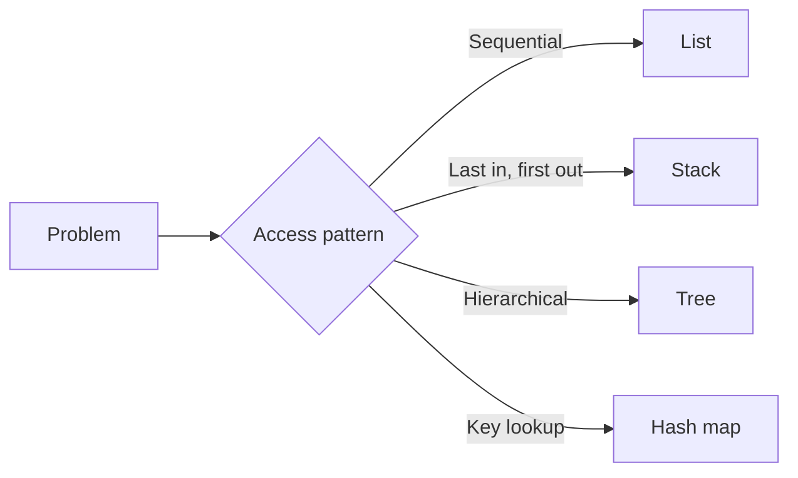

A practical foundation for choosing how information should be represented, accessed, and changed.

- The shape of the data often determines the shape of the algorithm.
- Runtime analysis matters when it informs a design choice.
- Implementing a structure makes its tradeoffs easier to remember.

# My experience

Data Structures made programs feel less like isolated instructions and more like designed systems. Choosing between a list, tree, stack, queue, or map changed both the clarity and performance of a solution.

# How the ideas connect

# What stayed with me

The most useful question is rarely “Which data structure is best?” It is “Which operations need to be easy, and what tradeoff can this system accept?”

## Advice for someone taking it

1. Draw the structure before writing the operation.
2. Become comfortable with references and recursion early.
3. Test empty, single-element, and duplicate-value cases.
