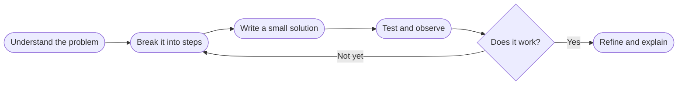

The course that gave me a durable way to turn an unfamiliar problem into something a computer—and another person—could understand.

- Break a large problem into small, testable steps.
- Read error messages as information rather than failure.
- Write code that another person can follow.

# My experience

This was my formal entry into computer science. The most important shift was learning that programming is less about remembering syntax and more about decomposing a problem, testing an idea, and communicating a solution clearly.

# What stayed with me

Clear names and structure are not decoration. They make a program easier to reason about, debug, and trust.

## The learning loop

## Advice for someone taking it

1. Practice consistently instead of saving everything for one long session.
2. Trace your program by hand when its behavior surprises you.
3. Ask why a solution works, not only whether it passes.

> The best early habit is becoming comfortable with not understanding something yet—and knowing how to investigate it.
