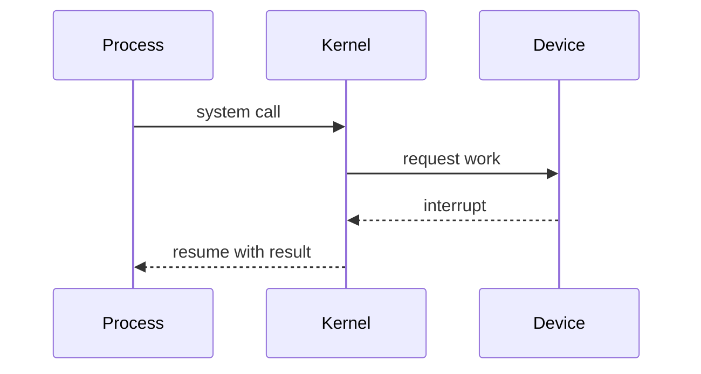

I am using Operating Systems to deepen the systems perspective I began developing in Systems Programming and Computer Architecture.

- Concurrency requires reasoning about many execution orders.
- OS abstractions balance safety, performance, and convenience.
- Mental models matter when behavior is not directly visible.

# My experience so far

The course focuses on the mechanisms that coordinate processes, memory, files, and shared hardware. It is making familiar operating-system behavior feel less automatic and more like a collection of deliberate tradeoffs.

# A working mental model

## Advice for someone taking it

1. Review low-level memory and process concepts before the semester begins.
2. Draw state transitions and timelines for concurrent behavior.
3. Expect understanding to come through careful iteration.
